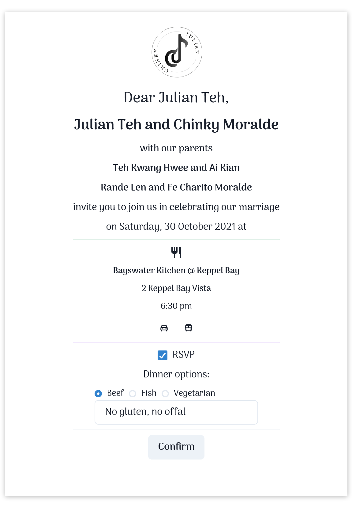
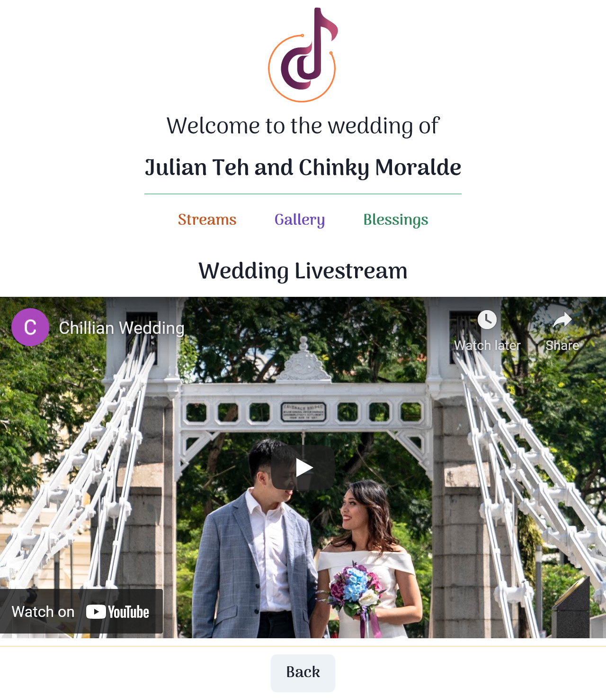

# Next.js/Vercel with React/TS website for my Wedding

As my wedding was approaching, I thought; what better way to motivate myself for a project than to build a website for my wedding? So I started out with the following goals:

1. Learn React
2. Build a simple e-invite website

Having already had experience with hosting a static website, I now ventured to implement a website that wrapped a database. Since security wasn't of much concern, I decided to limit the scope of the project to the following:

1. Each guest should receive a personalized link, through which they would RSVP
2. If necessary, the page should be printable
3. For those guests who were unable to come due to Covid-19, we should provide them a Livestream link

We soon settled on the following tech stack:

- React/TS with Next.js, hosted on [Vercel](https://vercel.com)
- [Heroku PostgreSQL](https://www.heroku.com/postgres) (Hobby tier) accessed through [Prisma](https://www.prisma.io/)
- [Paper-css](https://github.com/cognitom/paper-css) for print sizing
- Youtube Live for livestreaming
- Facebook Page for live event updates and gallery

This worked out pretty well; following a couple of tutorials and getting some help from a friend to learn how to use React, I was soon on my way to being able to develop more or less independently and make any tweaks necessary for data updates or layout changes.

It was quite eye-opening to work with both Server-Side Rendering through `GetServerSideProps` as well as Client-side `useEffect`, `useState` and the React `.tsx` syntax for HTML manipulation. It was even more eye-opening to work with Prisma's API, and realizing that it would only run on server-side calls (as well as how to make these calls from the Client-side).

This turned out to be even more useful as we considered how we would conduct the church ceremony and dinner reception, and realized that having a website would enable us the flexibility of hosting our own streams, games, activities, gallery, and so on. This would make it easier to do a wedding that needed social distancing, while including more people, especially family and friends overseas who were not able to join us.

Overall this was a very enriching experience - and a wonderfully useful use case - that helped me grow in my knowledge and skill in Web development
