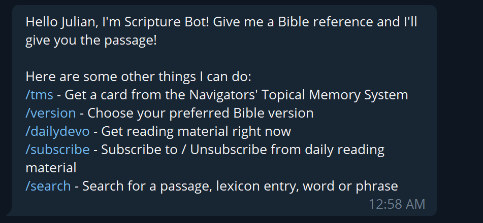
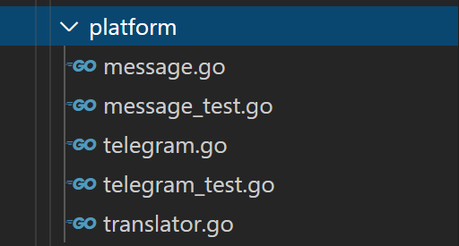

# Re-writing my Telegram Bot in Golang

I had originally written a bot for Telegram (originally named Biblica Bot) which was intended to be a bot for quick reference to the bible. It had a few nifty (at least to me) features:
- Retrieve a bible passage given a reference using BibleGateway
- Allow the user to set a version to get the passage in
- Retrieve a verse from the Navigators' Topical Memory System
- Subscribe to any of the following daily updates
  - M'cheyne's bible-in-a-year reading plan
  - desiringgod.org's daily top articles
  - Our Daily Bread's daily devotional
- Search for the lexicon definition of a word using BlueLetterBible

The original was written in Python - a learning experience in and of itself - using WebApp to host the service on Google App Engine. It used Google App Engine's blob store to keep track of user preferences (version, current actions, subscriptions, etc...) and had a cron job which would also trigger subscriptions at a fixed time every day. I didn't get round to making that fixed time into a user choice before moving on.

This also became a way for me to enhance my knowledge of back-end development, REST API usage, and chat bots in general. I had plans to extend the bot to handle multiple platforms (why stop at Telegram?) which similarly exposed chat bot API, and had managed to refactor the Python 2 version so that the framework was extensible - and then it sunsetted, and with it most of my motivation to continue developing the bot in Python 2.

As such, I decided to evaluate a few languages as potential replacements; notably C#, Golang, Node.js and Python 3. Eventually I filtered it down to Golang, the primary reason being that I had other projects which would be appropriate for the remaining languages, and Golang had a pretty smooth tie-in with Google App Engine (after all, it is developed by Google) and was available on the Standard environment (I didn't want to create a datastore just for user data).

So I began to develop in Golang, and here are some of the walls I hit (and therefore the things I learned) from smallest to biggest:

## 1. Hosting
Since I was using Google App Engine, most of the complexity was taken care of. It was a bit of a struggle to figure out how I should deploy (and what changes there would be in the folder structure after deployment, especially when taking into account static resource locations).

I'm not sure even now that I figured it out completely, but it worked to put resources in the root of the main package (my guess is that the compilation step puts the resulting binaries parallel to the main package, but does not maintain other static data locations)

Observations:
- Google App Engine has a pretty good integration story, and I'm very sure I'm not utilizing all of it (I settled for just using the cloud console shell, since it was a good way to spin up and keep secrets separate from my code). It was quite straightforward to deploy after reading documentation (failing a couple dozen times is normal for a newbie, right?).
- Just about all the functionality is also instrumented in a panel somewhere, so after hosting, you could monitor cron jobs, app usage, logs, and so on. I like it a fair bit, although I haven't delved nearly as deep into other platfoms to be able to say Google App Engine is the best.

## 2. Programming Language
Coming from a C/C++ background and having experience with Rust and JavaScript/TypeScript (I suppose at some point languages start to look like mashups of other languages), this wasn't too bad. Conceptually it was very much like writing Rust (but less verbose), and since I wasn't taking advantage of channels (I didn't have any threading I needed to do), it felt quite comfortable to write once I got used to the syntax.

Observations:
- Serializing/Deserializing required a struct (as long as you want to use a package, at any rate), which both meant that it was frustrating to serialize data (missing any field, or having a bad name or even a bad metadata would cause an error), and safe. There's some debate over whether this is preferable over plain data structures, but it's interesting to note that Golang enforces this through their packages.
- Tooling was an interesting one. I'm aware that Golang's package management story is still in the works at the time of writing, but it's got most of the things I wanted from a tools perspective. Especially on VSCode, the Go extension simply recommended tools as I encountered situations, ranging from linting to language support to build tooling. Once all those were in, it would even automatically import and format out of the box (although also opinionated).
  - It seems that Golang advocates (and enforces within Golang's linter) a particular programming style. Egyptian style braces, for example, or SentenceCase fields for structs. Not complaining, but it might be a little bit of a shock for an experienced programmer who is used to one particular style.

## 3. Testing
Testing was tedious (this being a solo project), but it was pretty worth it. Once I had my MVP up (logging and base functionality), I immediately started on testing. I figured it would be useful to also have it run automatically on Github, so I set up a Github Actions for it.

This proved troublesome mainly because of the folder structure. I had initially split up the functionality into 3 big parts, and each had its' own repository:
1. Secrets handling
2. Platform handling
3. App handling

This initially was set up as one main (ScriptureBot) and two packages, with the idea that Secrets and Platform handling could be reused for other bot projects. This proved to be insufficient for my liking once I started writing tests; I felt that there were too many overlaps within each package to be properly testable, and it would cause my test files to be strewn across the root directory of each package.

So I broke up each of the packages into smaller parts where it made sense, and wrote tests for each of the packages. I later absorbed Secrets handling into Platform handling and renamed it. This resulted in just two repositories with well ordered packages; [Platform](github.com/julwrites/BotPlatform) and [App](github.com/julwrites/ScriptureBot).

Ultimately this was a valuable decision; having the tests allowed me to save huge amounts of time finding bugs on production, and instead I was able to catch them early in the tests instead. Furthermore it acted as automated regression tests, so if something did break somewhere (even if it wasn't my code), I'd catch it. All these went into Github Actions to be triggered for each PR, so that I'd have a fairly high confidence that the bot would work when deployed.

Observations:
- Golang Tests are written in a somewhat similar way to Python Tests (in my experience anyway); they recognize a particular file name as a test file, and this has to be in the same space as the package it is testing. Alternatively, the test function can be named in a specific way and kept within one of the source files. I opted for the former, since I wanted to keep tests separate from code (debatably not the better option, but my preference nonetheless).

## 4. Package Management
This was probably the one I struggled with the most, and the primary reason I found myself refactoring my code thrice before I managed to push it to production. I think it was partly the learning curve of the language, but this was probably the most frustrating part for a few reasons:
1. Coming from languages which have no restrictions around where code is located, it was not immediately obvious that Golang did (In fact, if you don't import any packages beyond the inbuilt ones, it would be completely non-obvious). It was only when I wanted to import an external package that I ran into this issue, and then discovered that 'Oh, go files have to be in gopath/src/<host>/<username>/<repository>'.
2. Again, coming from languages where folder structure is flexible and therefore allows any style of 'housekeeping', it was confusing that Golang has enforced a specific folder structure. I initially thought the structure only applied across repositories, and then later discovered that there was a specific structure for packages within each repository. Neither of these were immediately obvious to me. In retrospect I can see that it was a design choice, though an opinionated one.

That being said, after learning the enforced structure (a repository can have multiple packages, and can import packages from other repositories) and best practices (e.g. always use full paths for imports), it was pretty smooth to use. The main hurdle was finding out that there was an enforced structure and figuring out what it was.

Observations:
- Golang enforces a folder structure which also coincides with package management. A repository would typically have 1 or more packages (each source file is marked to belong to a particular package), and each package must wholly and uniquely reside in a single folder. When importing, it is best to import using the full path (e.g. github.com/julwrites/ScriptureBot/app).
- While an opinionated design, this has benefits. Since there is an enforced structure, it is harder for developers to make mistakes, or to write code with minor deviations from one another (therefore leading to misunderstandings and so on). It means that the compiler or interpreter can analyse the repository and perform checks that would not have been possible if (like in C) files could be missing and their location not be stated. Arguably more restrictive, but also safer.

All in all, I think it was a good decision to get into this. I can say I've learned Golang, and I've made something with it that I can use on a daily basis, so I think that's already a win. There's still a fair amount of work I have to do on the bot to bring it up to par, but it's not so different from the work that is already done, so I don't think I'll do a specific post about it.
