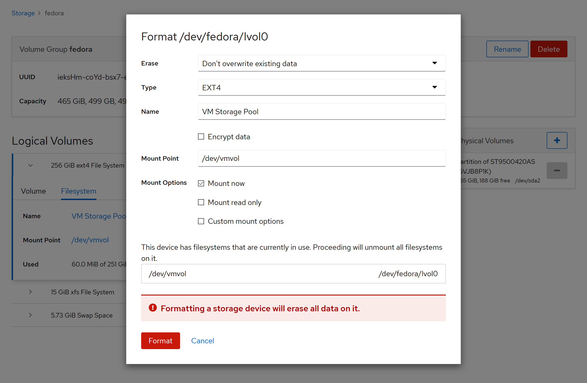
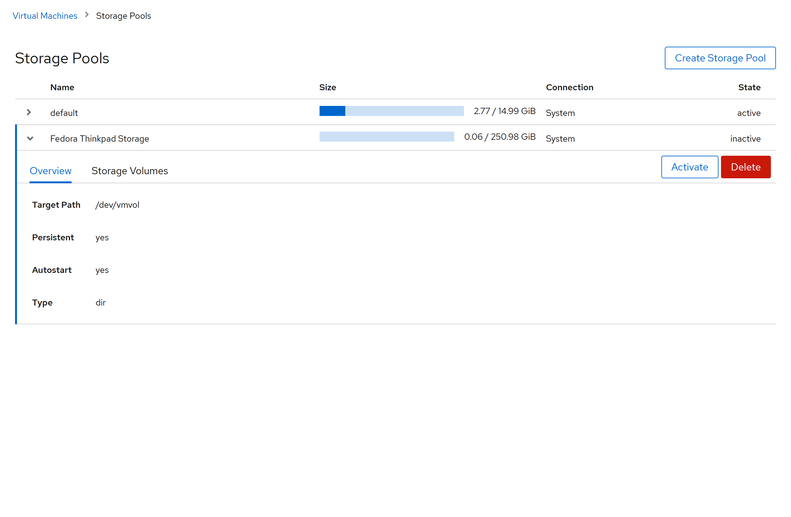

# Setting up a Fedora Server on an old laptop

Several years back, I had loaned my old laptop to one of my mentees, because he didn't have his own. This year, since he was about to start University, he had gotten himself a swanky new one, and so the old laptop returned to me. Seeing as I now had an unused piece of hardware on my hands, I decided that this would be a good opportunity for me to try experimenting further with Linux administration.

Some research and a couple of discussions later, I decided to go with Fedora Server. I had considered the more common ones, but CentOS and Ubuntu were more for desktop use, and ArchLinux was a bit too bare-bones for my liking. Fedora seemed to have a good mix of server and desktop (I could have a server and run a VM for the desktop) and so I decided that would be my choice - not to mention it came with Cockpit, which had interested me greatly.

I got the .iso file from [Fedora](getfedora.org) and flashed it on a USB drive using Etcher, plugged it in, and I was on my way.

The installation interface was pretty much the same as CentOS (Well, they are from the same developers) and so it was quite smooth to get things started.

Then the hiccups began.

First wifi wouldn't work, and I spent one night figuring out why that would be the case, running `ncmli` again and again to attempt to enable it or find the AP. Eventually it came down to this; I didn't have `wpa_supplicant` installed (Which I found as an [issue](https://bugzilla.redhat.com/show_bug.cgi?id=1756488) in the Bug list of Fedora Server 31), and so it was not able to enable the wifi device.

So I connected it via Ethernet cable, finished the install, installed `wpa_supplicant`, enabled and started `iwd.service` and `wpa_supplicant.service`, and connected to the wifi using `nmcli device wifi connect ...`.

A [few steps later](https://cockpit-project.org/running.html) I had Cockpit started up and connecting on wifi as well as ethernet.

It was pretty sleek, to be honest, and I was quite impressed at how much I could do on it. It even had a terminal which allowed me to do most administration tasks.

Then I attempted to create a Virtual Machine, thinking that I could try running a desktop VM on it, and expose it for use. I was getting pretty impressed at how easy it was to [create and launch a VM in Cockpit](https://fedoramagazine.org/create-virtual-machines-with-cockpit-in-fedora/) when... I didn't have space? It seemed that there was a problem with the drive management on my machine. Naturally, this meant that my virtual disk couldn't be allocated, and when I attempted to `fdisk` away the problem... I `fdisk`-ed away my partition. One reboot later, I was back to square one.

... One reinstall later ...

I started looking around my terminal to try and figure out what exactly was missing. Cockpit did recognize my disk with the correct size, but it wasn't listing it as a drive to be used. Some `lsblk` and searching later, I found out the problem; I needed to [create a new logical volume](https://fedoramagazine.org/storage-management-with-cockpit/) which Fedora had not allocated for when automatically partitioning my drive.

Now armed with this knowledge, I installed `cockpit.storaged`, rebooted the server, and now I could create a new logical volume. I created this, mounted it onto `/dev/vmvol`, and created a new storage pool for Virtual Machines.

In short, on top of my fedora server set up, I had to install the following packages:
- Wifi device:
  - `dnf install wpa_supplicant`
  - `systemctl enable iwd.service --now`
  - `systemctl enable wpa_supplicant.service --now`
  - `nmcli device wifi connect <SSID> password <PW>`
- Storage:
  - `dnf install cockpit.storaged`
- Virtual Machines:
  - `dnf install libvirt cockpit-machines`
  - `systemctl enable libvirtd --now`
