# Setting up Code Server using Docker on Fedora

At the time of writing, Fedora 31/32 had not yet implemented enough support for `nftables`, and this was causing Docker and Podman both to run into [problems](https://fedoramagazine.org/docker-and-fedora-32/) while running or exposing their interfaces for management. While I managed to get Portainer running in my last post, it was not able to actually launch or run any docker containers through `docker-compose` and `moby`.

Since my intent in setting up a Fedora Server was to build a personal cloud development environment, I wanted to get my machine to a point where I could at least launch a VM or a container with [code-server](https://github.com/cdr/code-server) installed, and have that exposed for use on my domain (with some password protection). As such I decided to start the project again with an older version of Fedora which had not yet moved to `nftables`, and therefore retained support. 

I managed to get an `.iso` of Fedora 30, and ran the basic setup. This already had `cockpit` installed by default, and it was accessible just by checking the local IP address of the machine. 

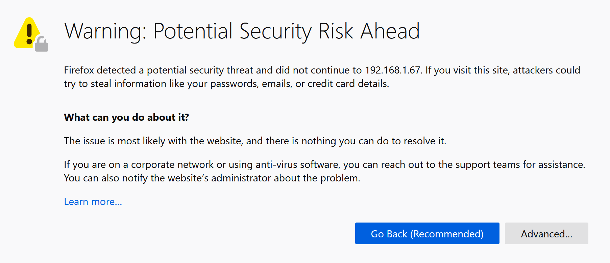
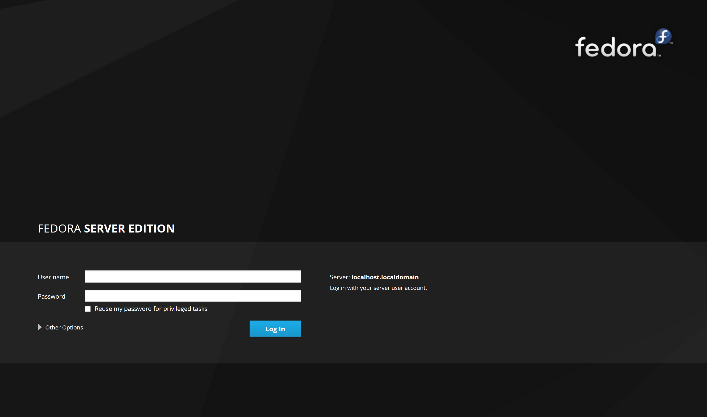
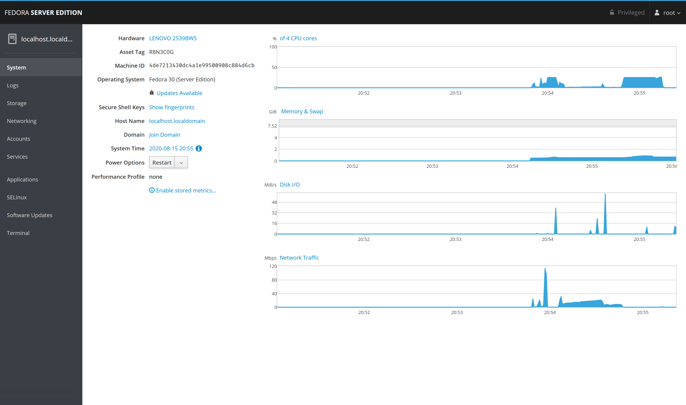
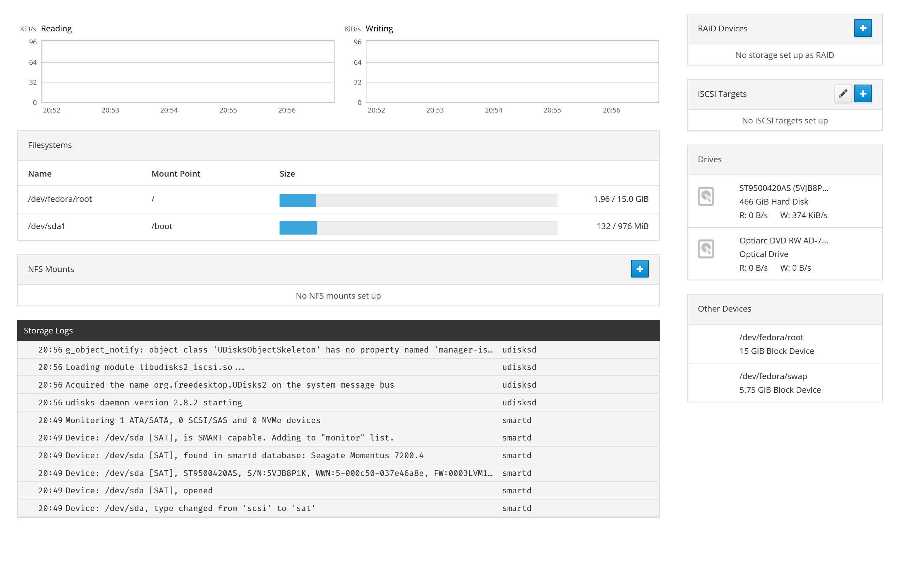

The web interface was nothing to complain about, and the same sort of problems were visible here as well as in the Fedora 32 installation. I had to run a couple of installs to get software updates, and this conveniently installed`cockpit-storaged` for Cockpit to be able to manage the LVMs on the machine. 

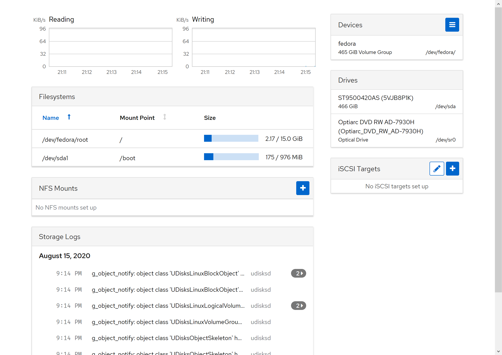

Next was `docker` and `cockpit-docker` for Cockpit to be able to download, create, and manage the Docker containers on the machine.

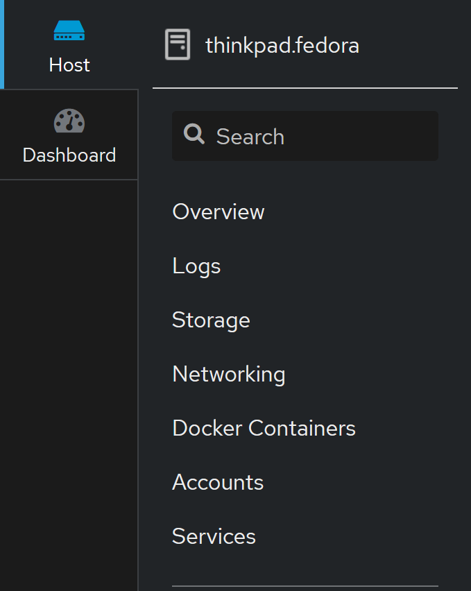
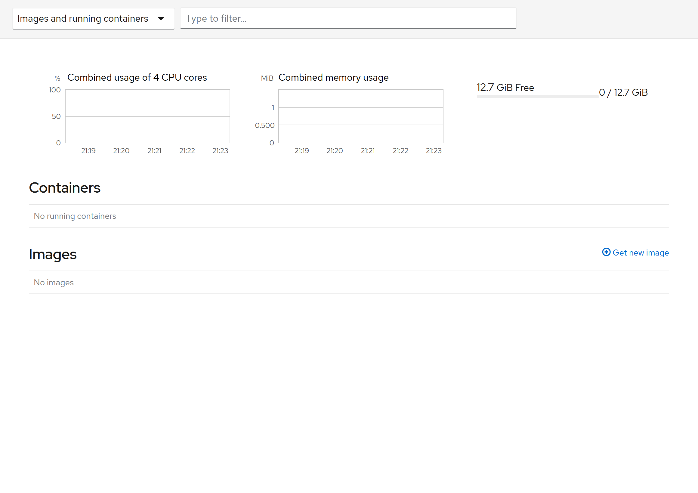

I was able to partition my unused disk space into a nice LVM chunk for docker use, and to download a docker image for [code-server](https://registry.hub.docker.com/r/codercom/code-server/#!) quite conveniently.

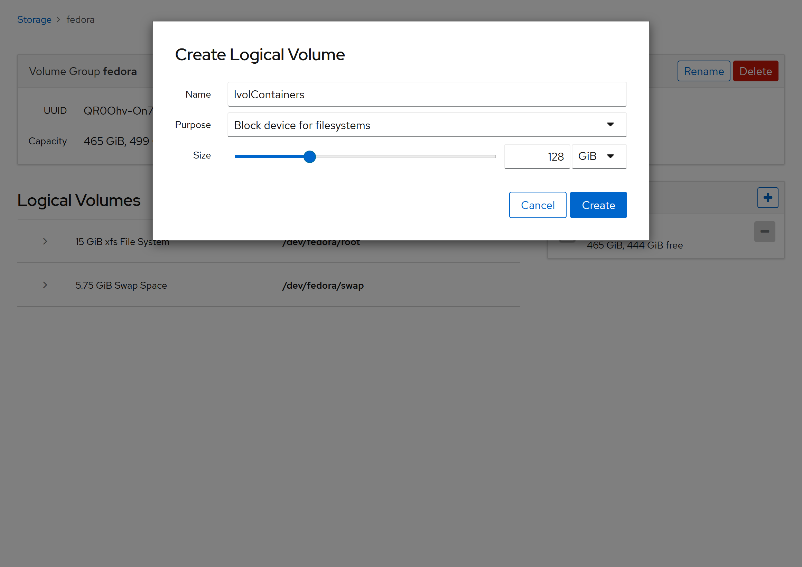
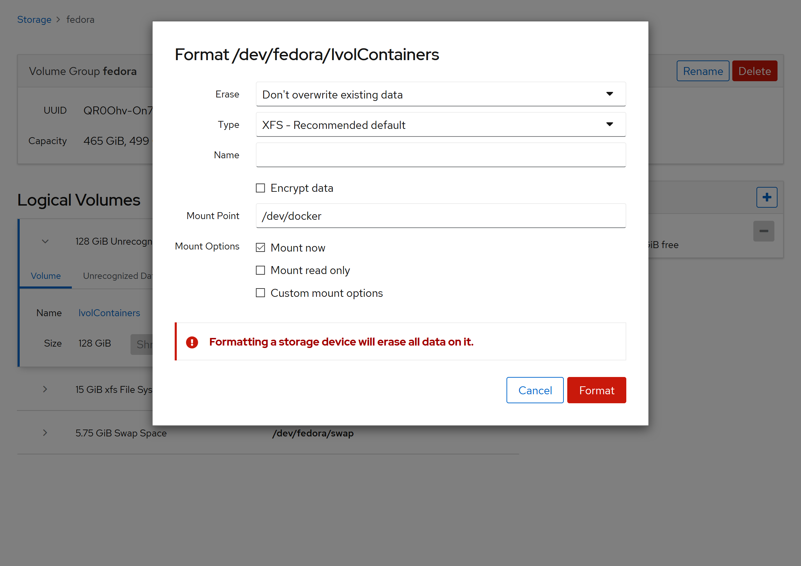
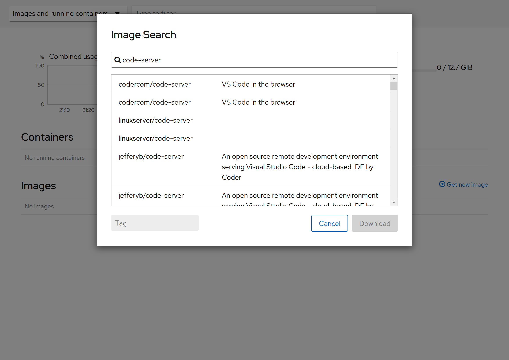

There were a few things that needed to be done to get the docker image up and functional:
- Allocating a volume (Part of the Docker image setup)
- Routing the docker image's port to the host port on 8080 (Also part of Docker image setup)
- Defining a password (As an environment variable for the Docker image)
- Server firewall to allow access to Docker (`firewall-cmd --permanent --add-interface=docker0 --zone=trusted`)

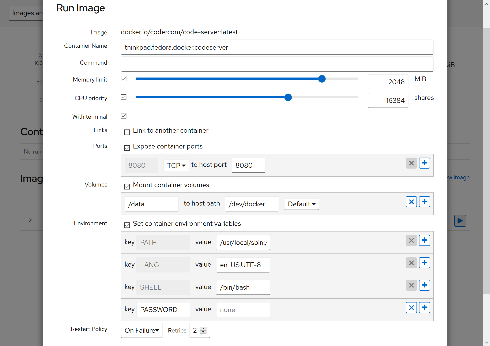

Once this was done though, I was able to access code-server on my browser, and even get my personal settings up and running. 

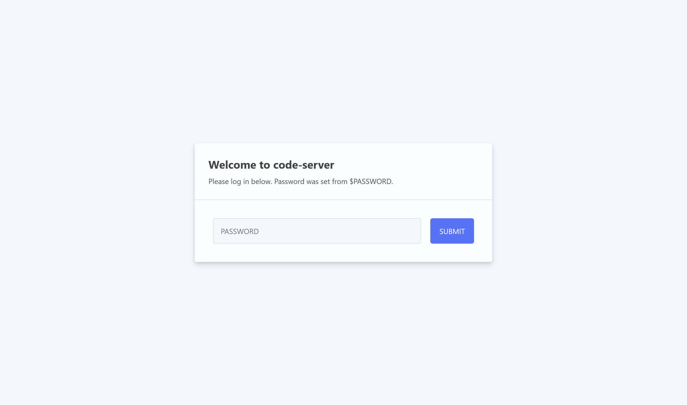
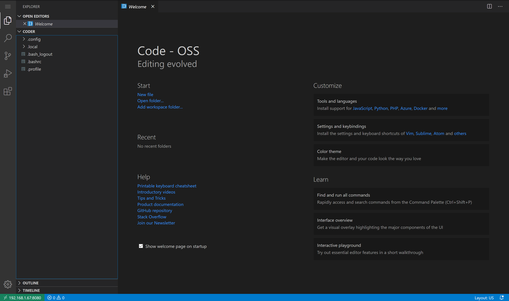

All in all this was much smoother, probably because much of the workflow had already been established for more than a year (Fedora 30 was released early 2019), and as such was already stable compared to Fedora 32.