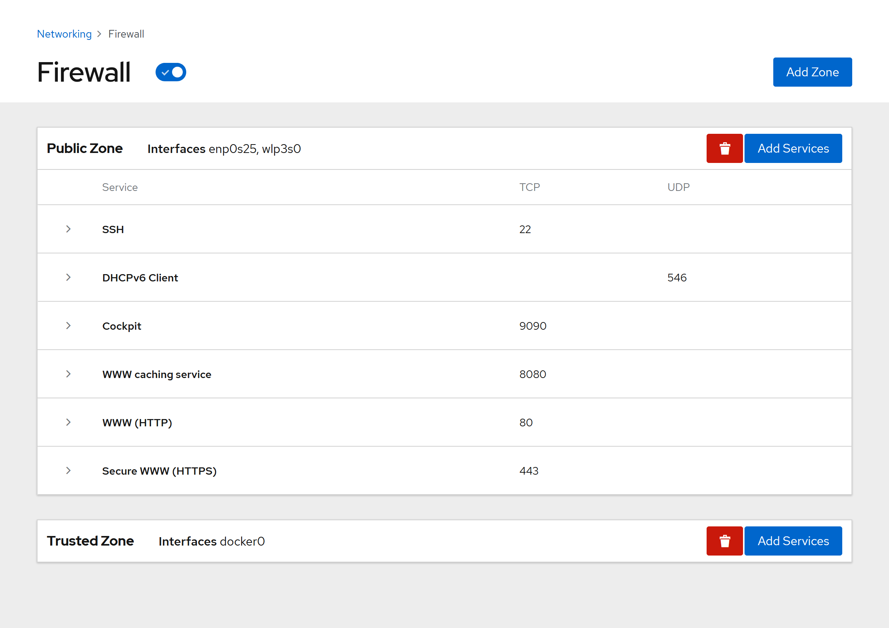
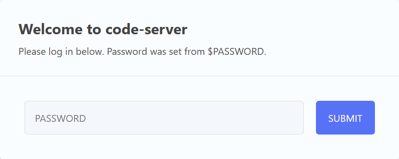
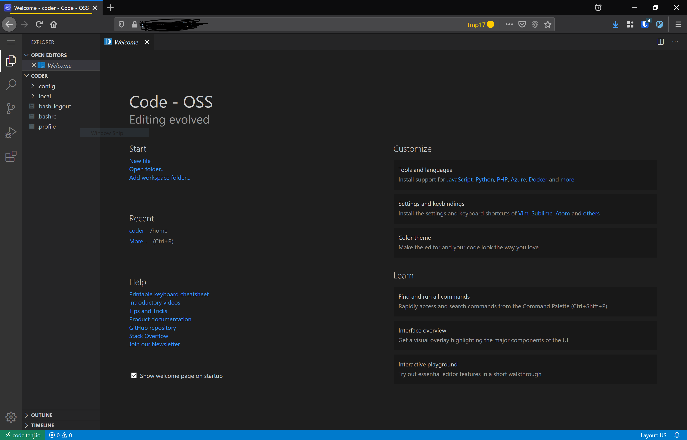

# Setting up Nginx Reverse Proxy to Custom Domain

Next I wanted to be able to access this from my custom domain, and therefore have a browser-based IDE available for myself anywhere with internet access. 

This took a little more work; I had to install `nginx` to serve as a reverse proxy, and `certbot-nginx` for SSL encryption.

A couple of commands later...
- `dnf install -y nginx certbot-nginx`
- `systemctl enable nginx --now`

Some configuration needed to be done for `nginx` to do proxy passing to my existing servers. I had previously set up NextCloud on a Raspberry Pi, so that had to be modified to allow the new server with `nginx` to handle the reverse proxy for all devices behind the IP address. 

I set up the `nginx.conf` to listen on Port 443, and did some [configuration](https://www.digitalocean.com/community/tutorials/how-to-secure-nginx-with-let-s-encrypt-on-centos-7) to perform a `proxy_pass` to the other servers involved. This proved tricky when it came to SSL certification; LetsEncrypt required that the custom domain being specified for SSL certification be accessible and responsive, which led to a number of retries and that in turn led to a number of failed attempts, which... Had some [rate limits](https://letsencrypt.org/docs/rate-limits/) that made it quite a pain to get working.

I then added an A record to my subdomain, and pointed it to my public IP address, added port forwarding on my router to my device for `http` and `https` access, and... Poof, went my Cockpit access. I had managed to cause Cockpit's SSL cert to be replaced. This was, fortunately, easily resolved by SSH-ing into the client and re-running `certbot` to [replace the certificate](https://certbot.eff.org/lets-encrypt/fedora-nginx). 

Some debugging on whether `nginx` was actually listening to Port 443 told me that it was.
```
# netstat -anop | grep LISTEN | grep nginx
tcp        0      0 0.0.0.0:443             0.0.0.0:*               LISTEN      1049/nginx: master   off (0.00/0/0)
```

I made sure `certbot` was [registering my certificates and keys](https://certbot.eff.org/lets-encrypt/fedora-nginx) properly before proceeding, but this still didn't get me access through my custom domain. This did allow me though, to get past the rate limits since I now had valid certificates that did not need to be renewed, simply used. This was done by setting up my `nginx.conf` such that each server had it's own SSL configuration.

```
server {
    listen       443 ssl;

    server_name  <custom domain>;

    ssl_certificate         /etc/letsencrypt/live/<custom domain>/cert.pem;
    ssl_certificate_key     /etc/letsencrypt/live/<custom domain>/privkey.pem;

    access_log              /var/log/nginx/<custom domain>.access.log;
    error_log               /var/log/nginx/<custom domain>.error.log;

    location / {
        proxy_pass                http://localhost:8080;
        proxy_redirect            http://localhost:8080 https://<custom domain>;
    }
}
```

Next I had to make sure the firewall wasn't blocking my ports. This was fairly easy to do with Cockpit, and I was able to quickly check that the service was enabling Port access for 443.



Another thing to check was that SELinux wasn't blocking something that docker needed to access the network, so after some [searching](https://stackoverflow.com/questions/23948527/13-permission-denied-while-connecting-to-upstreamnginx)...

```
setsebool httpd_can_network_connect on -P
```

Finally I found that `nginx` was running as root, but that `nginx.conf` had set the user field to `nginx` instead of `root`. Once this was toggled, access to my code server was enabled, and I could see the login page. 



This had one last issue, which was that while the login page displayed, and I could log in, code-server didn't load. Opening the console window showed a whole bunch of `websocket` errors, and upon some research, I found that this was because `nginx` needed to pass more [proxy header information](https://github.com/websockets/ws/issues/979#issuecomment-337934638) to docker than it was already doing (it was receiving a success code back that it didn't know how to handle)

```
location / {
    proxy_pass                 http://localhost:8080;
    proxy_http_version 1.1;
    proxy_set_header   Upgrade $http_upgrade;
    proxy_set_header   Connection "upgrade";
    proxy_set_header   Host $host;
}
```

Once this was done, everything worked, and code-server was accessible from the browser through my custom domain. 

